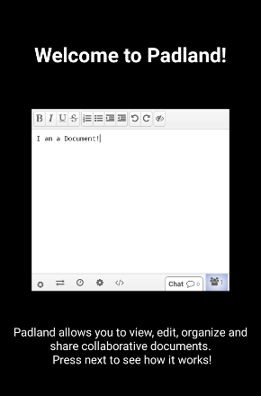
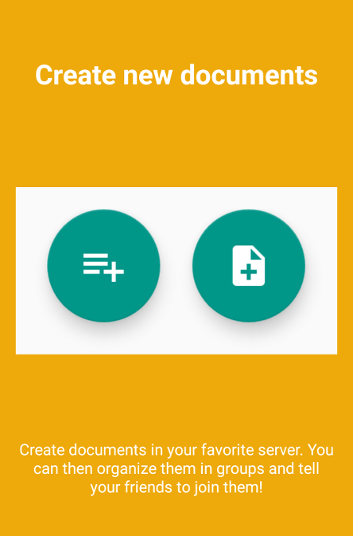
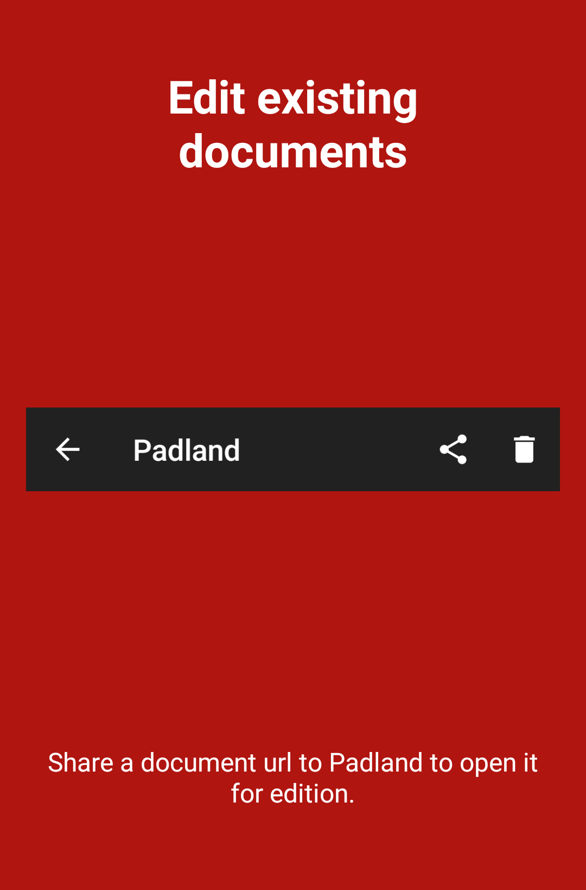
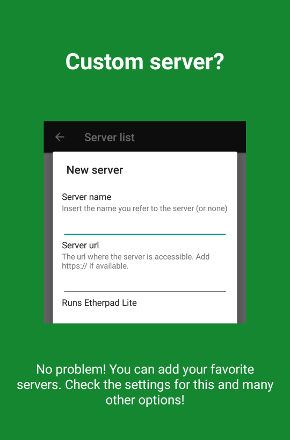
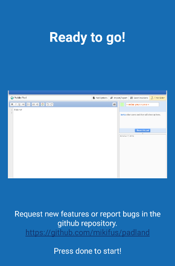

# Padland
Padland is a tool to manage, share, remember and read collaborative documents based on the Etherpad technology in Android.

  
  
  
  
  

## Translations
Thanks to all the volunteers that already contributed!
More translations are still needed as well as spell checking and keeping the current ones up to date.

## Current version
1.3.2

## Changelog
### v1.3.2
- Added a fancy introduction to understand the app
- Color picker on the preferences option
- Custom servers feature: add your own servers
- HTTP login: Access a pad behind an http auth
- Added support for URLs with complex parameters
- All known bugs

### v1.1.4
- Added Malayalam translation
- Added Piratenpad server

### v1.1.3
- Added French translation
- Fixed a bug that caused the app to crash in some devices

### v1.1.2
- Removed unused permissions
- Added Etherpad.net server

### v1.1.1
- Added German translation
- Added Japanese translation

### v1.1
- Added spanish and catalan translation
- Ready for a beta release

### v1.0
- Now documents can be classified in groups
- Pads will by default appear in the "Unclassified" group
- Groups can be added and deleted
- Pads can be moved to groups in bulk
- Design improvements
- Security: Protected from undesired hosts to run java methods from javascript (disables some tracking too).
- A hosts whitelist was added. Supports "*" wildcard for subdomains.
- Improved compatibility with older Android versions (not lower than SDK 14)

### v0.3
- Added a parameter to count the times a pad was accessed
- Added a loading animation
- Improved stability issues
- Landscape orientation is not forced anymore
- Pad names can't be free strings now
- Fixed minor bugs

### v0.2
- Added a view with pad data
- The "last used date" parameter is updated correctly

### v0.1
- Added multiple-server support
- Just commit

## Technology
Padland depends on:
- jQuery
- etherpad-lite-jquery-plugin

### License
----
Apache

[Etherpad]:http://etherpad.org/
[etherpad-lite-jquery-plugin]:https://github.com/ether/etherpad-lite-jquery-plugin
