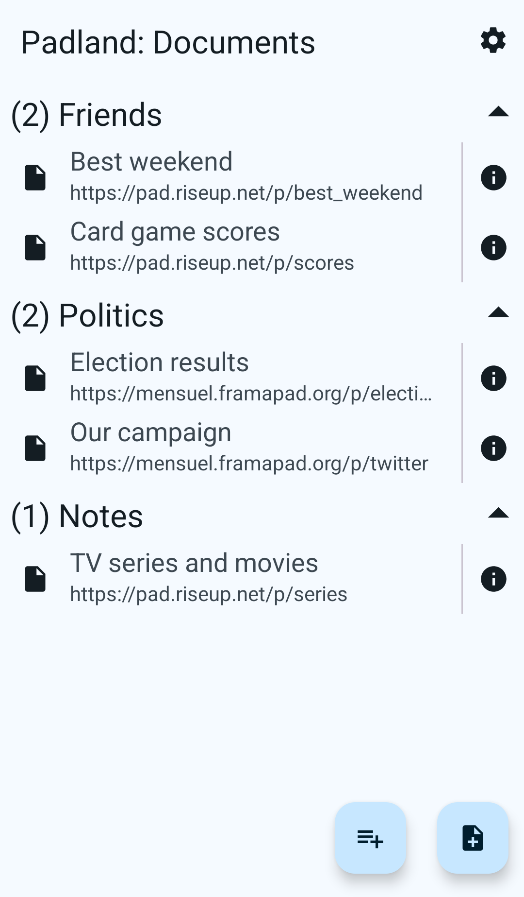
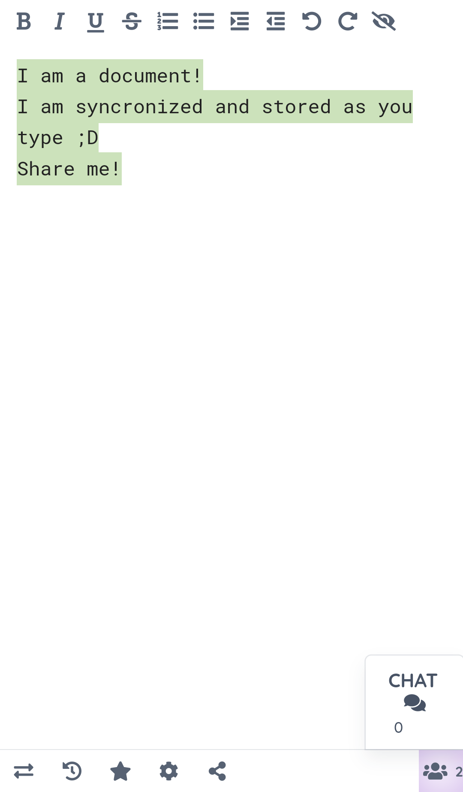

# Padland
Padland is a tool for Android to manage collaborative documents based on the Etherpad or CryptPad technology.

  

  

  

  <picture>
    <source media="(prefers-color-scheme: light)" srcset="./metadata/com.mikifus.padland/en-US/images/phoneScreenshots/1.png">
    <source media="(prefers-color-scheme: dark)" srcset="./metadata/com.mikifus.padland/en-US/images/phoneScreenshots/2.png">
    
  </picture>

  <picture>
    <source media="(prefers-color-scheme: light)" srcset="./metadata/com.mikifus.padland/en-US/images/phoneScreenshots/3.png">
    <source media="(prefers-color-scheme: dark)" srcset="./metadata/com.mikifus.padland/en-US/images/phoneScreenshots/4.png">
    
  </picture>

## Translations
Thanks to all the volunteers that already contributed!
More translations are still needed as well as spell checking and keeping the current ones up to date.
Please transtale on the [Weblate](https://toolate.othing.xyz/projects/padland/).

  

## Features
### Custom servers
Allow the user to add a custom server like "pad.myserver.com".

### Groups
Organize documents in groups.

### Compatibility
Padland is compatible with any Etherpad or CryptPad server.
Other providers may work but are not guaranteed to be compatible.

### Import / Export
Export the whole database to a file and import it back.
It does not store settings.
You can also paste a list of URLs to import from the clipboard by long pressing the 'new pad' button.

## Current version
4.0

### Changelog
[Changelog](CHANGELOG.md).

### License
----
Apache
